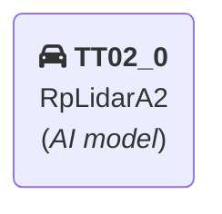
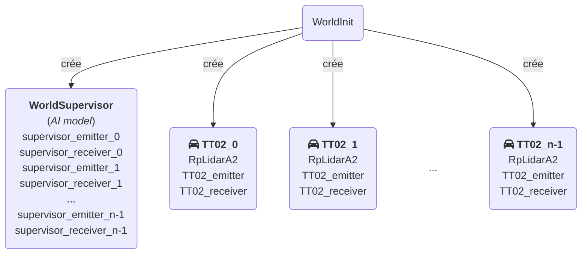
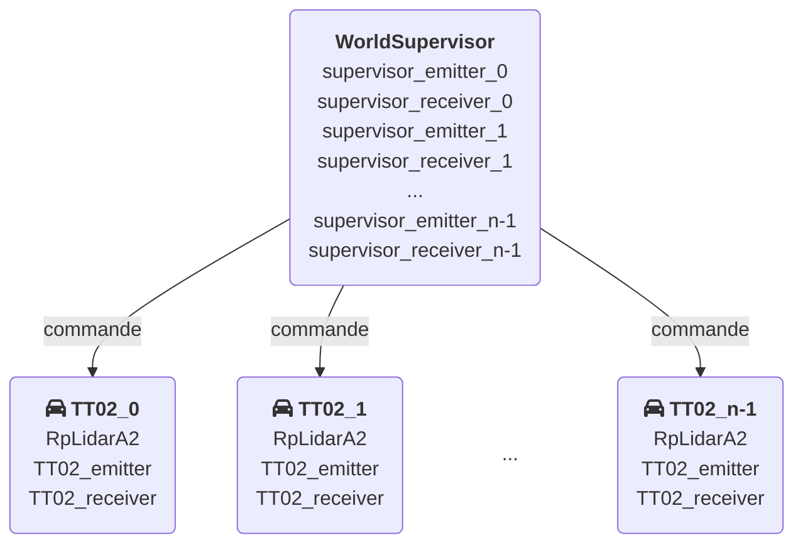

# Simulateur

Cette page de documentation détaille le fonctionnement des scripts utilisés dans le cadre de l'utilisation de [Webots](https://cyberbotics.com) pour entrainer une IA sur une simulation de piste.

---
## Objectifs

On cherche à simuler le déplacement d'une voiture dans un environnement semblable à la piste de la course. A chaque étape de la simulation on donne en entrée les données des différents capteurs à un model qui nous renvoie une consigne d'angle de roues à appliquer au véhicule pour la prochaine étape de la simulation.

---
## Organisation basique à une voiture

Une première approche pourrairt être d'organiser notre monde avec une [Piste](#piste) et une [Voiture](#voiture). Dans cette approche toute la logique serait géré au niveau du [Driver](https://cyberbotics.com/doc/automobile/driver-library) de la [Voiture](#voiture):
- obtenir la data des capteurs
- exécuter le model pour obtenir une consigne
- update l'état de la voiture en accord avec cette consigne
- puis finalement calculer les rewards données à la fin de chaque episode pour entrainer l'[IA](./IA.md)

!!! note
    Le problème de cette architecture est qu'elle n'est pas scalable. Elle nous force à n'utiliser  qu'une seule voiture en même temps car en augmentant le nombre de voitures, elles gèreraient toutes leur propre model en local et on entraînerait donc _n_ models au lieu d'un 1 ce qui est inutile.

---
## Organisation complexe à _n_ voitures

Pour s'affranchir de ces limites on propose de déplacer l'éxécution du model dans un controller séparé des _n_ voitures. On choisira donc de crééer un [Robot](https://cyberbotics.com/doc/reference/robot) de type [Supervisor](https://cyberbotics.com/doc/reference/supervisor) qu'on nommera `WorldSupervisor` en ajoutant le field `supervisor TRUE` dans la string de définition du node correspondant à notre supervisor. Notre objectif est de créer _n_ voitures à l'initialisation du monde et de faire communiquer les voitures et le WorldSupervisor via des [Emitters](https://www.cyberbotics.com/doc/reference/emitter)/[Receivers](https://www.cyberbotics.com/doc/reference/receiver). Il faut donc que le WorldSupervisor ait _n_ couples d'[Emitters](https://www.cyberbotics.com/doc/reference/emitter)/[Receivers](https://www.cyberbotics.com/doc/reference/receiver) pour communiquer à chaque voiture sur un channel différent.

!!! warning
    _n_ n'est pas connu avant l'éxecution du controller du WorldSupervisor. Or, l'état d'un [Robot](https://cyberbotics.com/doc/reference/robot) pour les fonctions de controller dans Webots ne change pas dynamiquement i.e. si le WorldSupervisor s'ajoute lui-même des devices via son controller au cours de l'éxecution, ces derniers ne seront pas acessibles via la méthode `getDevice(name)`.

C'est pour cela qu'en plus d'un WorldSupervisor gérant la logique de l'[IA](./IA.md), nous avons besoin d'un autre [Supervisor](https://cyberbotics.com/doc/reference/supervisor) dont le rôle est de créer le WorldSupervisor avec ses _n_ couples d'[Emitters](https://www.cyberbotics.com/doc/reference/emitter)/[Receivers](https://www.cyberbotics.com/doc/reference/receiver) et les _n_ voitures au début de l'initialisation du monde. On nommera ce nouveau [Supervisor](https://cyberbotics.com/doc/reference/supervisor) `WorldInit`.

!!! warning
    L'API [Emitters](https://www.cyberbotics.com/doc/reference/emitter)/[Receivers](https://www.cyberbotics.com/doc/reference/receiver) ne garantit pas un planning spécifique pour la transmission. Il arrive parfois que plusieurs paquets soient regroupés et reçus ensemble ou qu'aucun packet ne soit reçu. Ces cas doivent donc être traités et on perd le déterminisme de l'entraînement.

---
### Pendant l'initialisation du monde

---
### Pendant l'exécution des controllers

---
## Environnement Webots utilisé

### Piste

Le monde utilisé est `Simulateur/worlds/piste2.wbt`. Ce monde vient de la version 2023 du [github officiel CoVAPsy](https://github.com/ajuton-ens/CourseVoituresAutonomesSaclay).

### Voiture

La voiture utilisé est TT02(`Simulateur/protos/TT02_2023b.proto`). Ce proto vient de la version 2023 du [github officiel CoVAPsy](https://github.com/ajuton-ens/CourseVoituresAutonomesSaclay).

### Capteurs

Les capteurs utilisés sont :

- Un [Lidar](./Lidar.md) aux specifications de notre vrai lidar.

- Un [TouchSensor](https://cyberbotics.com/doc/reference/touchsensor) uniquement sur le simulateur pour détecter les collisions.
